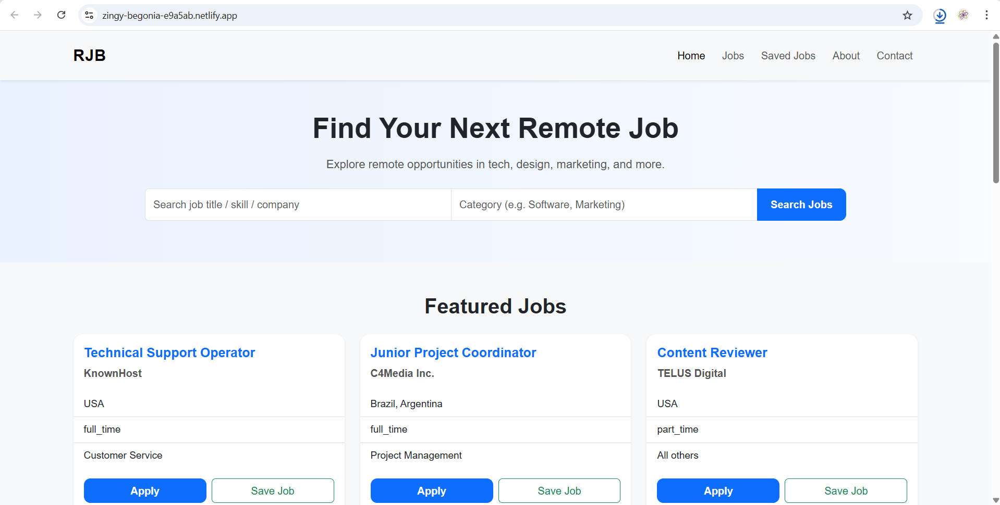
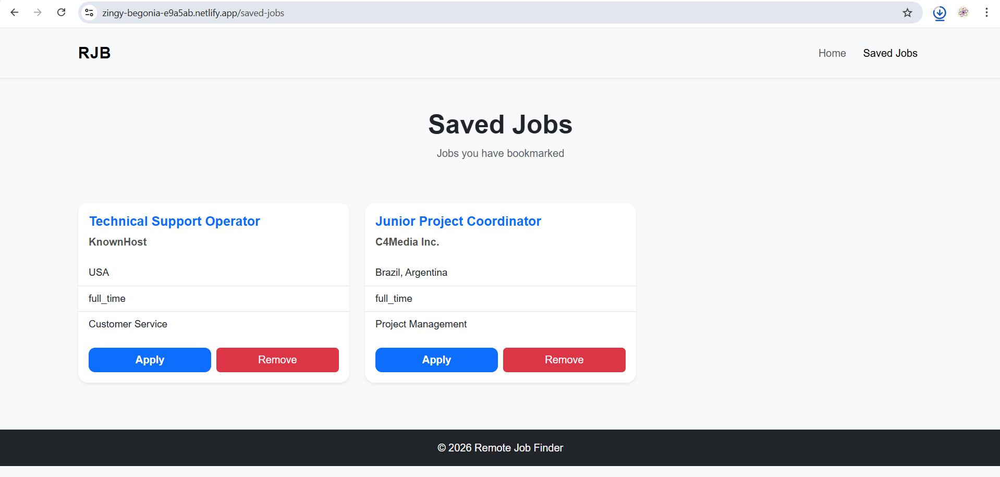

# Remote Job Finder Web App

## 🌐 Live Demo
👉 [View Live Project](https://zingy-begonia-e9a5ab.netlify.app/)

---

## 📌 Overview
Remote Job Finder is a responsive web application that allows users to search and explore remote job opportunities. It fetches real-time job listings using an external API and enables users to save jobs for later viewing.

This project demonstrates frontend development skills including API integration, dynamic UI rendering, and client-side data persistence.

---

## 🚀 Features
- 🔍 Search jobs by keyword  
- 🧠 Filter jobs by category  
- 🌐 Fetch real-time job listings using API  
- 💾 Save jobs using localStorage  
- 📄 View saved jobs on a separate page  
- 📱 Responsive design using Bootstrap  

---

## 🛠️ Tech Stack
- HTML5  
- CSS3  
- Bootstrap 5  
- JavaScript (ES6)  
- REST API (Remotive)  
- localStorage  

---

## 📂 Project Structure

    remote-job-finder/
    ├── index.html
    ├── saved-jobs.html
    ├── README.md
    ├── css/
    │   └── style.css
    ├── js/
    │   ├── script.js
    │   └── saved-jobs.js

---

## ⚙️ How It Works
- The homepage fetches job data from the Remotive Jobs API using `fetch()` and `async/await`  
- Job data is processed and dynamically rendered as cards using JavaScript  
- Users can search jobs by keyword and category  
- Clicking **Save Job** stores selected jobs in `localStorage`  
- Saved jobs are displayed on a separate **Saved Jobs** page  
- Users can remove saved jobs anytime  

---

## 🎯 Key Concepts Used
- DOM Manipulation  
- Event Listeners  
- Fetch API  
- Async/Await  
- Array Methods (`filter()`, `forEach()`, `some()`)  
- localStorage  
- Responsive Web Design  

---

## 📌 Future Improvements
- Add pagination / load more jobs  
- Improve category filtering with dropdowns  
- Add loading spinner  
- Add “No results found” UI  
- Add job details modal/page  

---

## ▶️ Run Locally
1. Download or clone the repository  
2. Open the project folder  
3. Run `index.html` in your browser  

---

## 🧩 Challenges Faced
- Handling dynamic rendering of job cards using JavaScript  
- Managing saved jobs using localStorage  
- Working with external API data and filtering results  
- Ensuring event listeners work for dynamically created elements  

---

## 📸 Screenshots

### Home Page

### Saved Jobs Page

---

## 👨‍💻 Author
**Shashank S**
